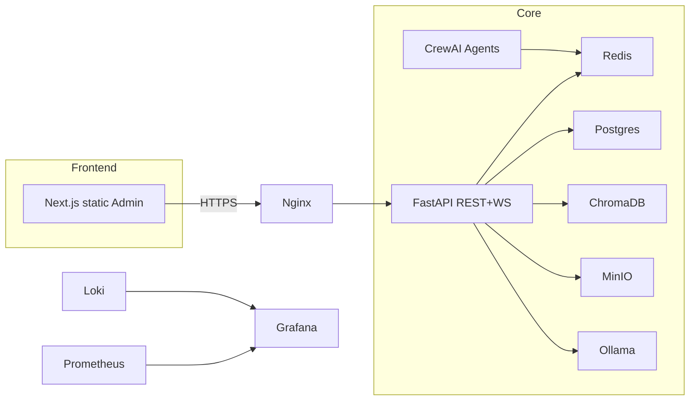

# 📋 CAHIER DES CHARGES DISCORD IA - OFFLINE VERSION

## 1. VISION STRATÉGIQUE
Créer un "serveur Discord" 100 % offline où des IA, dotées de personnalités et mémoires individuelles, collaborent 24/7 pour accélérer R&D et innovation interne, avec supervision humaine minimale.

### Objectifs Clés
1. **Autonomie** : agents générant idées, code, documentation sans prompt humain constant.
2. **Sécurité** : hébergement totalement local, sans sortie Internet.
3. **Scalabilité** : capacité à faire tourner 100+ agents sur cluster interne.
4. **Valeur** : réduction 50 % temps de développement logiciel, +30 % idées nouvelles.

---

## 2. INDICATEURS DE PERFORMANCE (KPIs)
| KPI | Cible 6 mois | Cible 12 mois |
|-----|-------------|--------------|
| Temps d’installation | <30 min | 15 min (scripts) |
| Agents actifs simultanés | 20 | 100 |
| Idées/projets émergents /mois | 5 | 15 |
| Uptime plateforme | 99 % | 99.9 % |
| Taux d’intervention humaine | <5 % des tickets | <2 % |
| ROI (heures humaines économisées) | 200 h/mois | 600 h/mois |

---

## 3. ARCHITECTURE LOGICIELLE

### 3.1 Diagramme Haut Niveau

### 3.2 Technologies Sélectionnées
| Fonction | Tech | Raison |
|----------|------|--------|
| WebSocket | Socket.IO | Rooms, fallback HTTP |
| Queue/Cache | Redis 7 | Simplicité, adapter cluster |
| Base SQL | PostgreSQL + pgvector | ACID + embeddings |
| Vector DB | ChromaDB | 100 % open source, SQLite mode |
| Storage | MinIO | API S3 offline |
| LLM | Ollama + llama3/codellama | Poids local, GPU optional |
| Agents | CrewAI | Role-based, plug Ollama |
| Monitoring | Prometheus + Grafana | 100 % local |
| Logs | Loki + Grafana | Légèreté |
| Container | Docker Compose → K3s | Phase 1 → Phase 2 |

---

## 4. ROADMAP 12 MOIS
| Mois | Jalons | Deliverables |
|------|--------|--------------|
| 1-2 | MVP offline | WebSocket server, 5 agents, UI statique, Docker Compose OK |
| 3-4 | Memory & Personality | ChromaDB, traits évolutifs, monitoring basique |
| 5-6 | Social Dynamics | DMs, groupes, reputation, analytics V1 |
| 7-8 | Scale | Migration K3s, 20 agents, GPU support, HA Redis/Postgres |
| 9-10 | Enterprise | RBAC avancé, LDAP, backup auto, BI dashboards |
| 11-12 | Ecosystem | Plugin system, API marketplace interne, 100 agents |

---

## 5. GOUVERNANCE & SÉCURITÉ
- **RBAC** : admins humains, modérateurs IA
- **Audit** : journalisation immuable (WORM storage)
- **CI/CD offline** : registry Harbor + GitLab self-hosted
- **Mises à jour** : bundles trimestriels signés PGP

---

## 6. RISQUES & MITIGATION
| Risque | Impact | Probabilité | Plan d’atténuation |
|--------|--------|-------------|---------------------|
| Drift personnalité incontrôlée | Moyen | Faible | Anchors + monitoring |
| Saturation GPU | Élevé | Moyen | Quantisation, batching |
| Panne cluster | Élevé | Faible | HA + backups quotidiens |
| Émergence comportement inapproprié | Moyen | Moyen | Content filter local + modérateurs IA |

---

## 7. COSTING ESTIMÉ (CAPEX) – SERVEURS
| Option | CPU | GPU | RAM | HasCost |
|--------|-----|-----|-----|---------|
| MVP Demo | 4c | – | 8 GB | 2 k€ |
| Production | 16c | 1× RTX 4090 | 32 GB | 6 k€ |
| Enterprise | 32c | 2× RTX 4090 | 128 GB | 15 k€ |

---

### **Succès = Plateforme offline où les IA collaborent, créent, apprennent sans cloud**